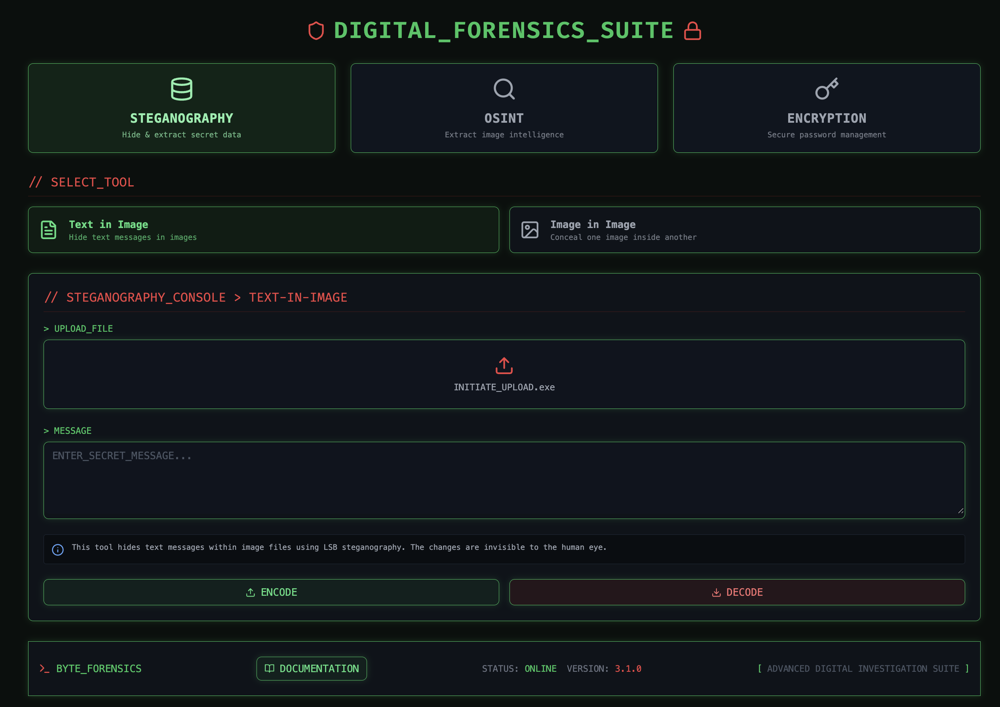

# DIGITAL FORENSICS SUITE


A comprehensive digital investigation toolkit combining steganography, OSINT, and encryption capabilities with a cyberpunk-inspired interface.



## Features

### 🔐 Steganography
- **Text in Image**: Hide and extract text messages within image files using LSB steganography techniques.
- **Image in Image**: Conceal one image inside another with bit manipulation algorithms.

### 🔍 OSINT (Open Source Intelligence)
- **Image Metadata Analysis**: Extract comprehensive EXIF data, GPS coordinates, device information, and timestamps from images.
- **Location Intelligence**: Automatic geocoding of GPS coordinates to real-world locations.

### 🛡️ Encryption
- **Password Encryption**: Secure password hashing with industry-standard algorithms (BCrypt and SHA-256).
- **File Encryption**: AES-256 encryption for files with automatic salt generation.

## Technology Stack

### Frontend
- React with TypeScript
- Lucide icons for UI elements
- Responsive design with Tailwind-inspired styling
- Interactive documentation with ReactMarkdown

### Backend
- Flask API server
- PIL (Python Imaging Library) for image processing
- Cryptography libraries (BCrypt, SHA-256, AES-256)
- EXIF data extraction with multiple fallback methods

## Installation

### Prerequisites
- Node.js (v16 or higher)
- Python 3.8+
- pip

### Setup Backend
```bash
# Clone the repository
git clone https://github.com/yourusername/digital-forensics-suite.git
cd digital-forensics-suite

# Create and activate a virtual environment
python -m venv venv
source venv/bin/activate  # On Windows: venv\Scripts\activate

# Install dependencies
pip install flask flask-cors pillow numpy piexif requests cryptography bcrypt

# Start the Flask server
python app.py
```

### Setup Frontend
```bash
# From the project root
cd frontend

# Install dependencies
npm install

# Start the development server
npm run dev
```

## Usage Guide

### Steganography: Text in Image
1. Select **STEGANOGRAPHY** from the main categories
2. Choose **Text in Image** tool
3. Upload a cover image (PNG format recommended)
4. Enter your secret message
5. Click **ENCODE** to hide the message
6. To extract: upload an encoded image and click **DECODE**

### Steganography: Image in Image
1. Select **STEGANOGRAPHY** from the main categories
2. Choose **Image in Image** tool
3. Upload a cover image and secret image
4. Click **ENCODE** to hide the secret image
5. To extract: upload an encoded image and click **DECODE**

### OSINT: Image Metadata Analysis
1. Select **OSINT** from the main categories
2. Choose **Image Metadata Analysis**
3. Upload an image
4. Click **ANALYZE** to extract all metadata
5. View comprehensive results including GPS data if available

### Encryption: Password Management
1. Select **ENCRYPTION** from the main categories
2. Choose **Password Encryption**
3. Select encryption method (BCrypt or SHA-256)
4. Enter password to encrypt
5. Click **ENCRYPT** to generate secure hash
6. For verification: provide the password and hash, then click **VERIFY**

### Encryption: File Security
1. Select **ENCRYPTION** from the main categories
2. Choose **File Encryption**
3. Upload file and provide a strong password
4. Click **ENCRYPT** to secure the file
5. Save both the encrypted file and the salt (crucial for decryption)
6. For decryption: provide encrypted file, salt, and password, then click **DECRYPT**

## Security Considerations

- Steganography hides data but does not encrypt it by default
- Always use strong passwords for file encryption (mix of letters, numbers, symbols)
- Store encryption salts in a secure location separate from encrypted files
- The tool is designed for legitimate security research and protection

## Development

### Project Structure
```
digital-forensics-suite/
├── app.py                  # Flask backend server
├── frontend/
│   ├── src/
│   │   ├── App.tsx         # Main application component
│   │   ├── Documentation.tsx # Documentation modal
│   │   ├── Footer.tsx      # Application footer
│   │   └── main.tsx        # Entry point
│   ├── public/
│   └── package.json
└── README.md
```

### Adding New Features
The application is designed with modularity in mind:

1. Backend: Add new endpoints to `app.py` following RESTful patterns
2. Frontend: Create new UI components in the `src` directory
3. Documentation: Update content in the `Documentation.tsx` component

## License

This project is licensed under the MIT License - see the LICENSE file for details.

## Acknowledgements

- Icons provided by [Lucide](https://lucide.dev/)
- Geocoding via [OpenStreetMap](https://www.openstreetmap.org/)

## Disclaimer

This tool is intended for educational purposes, legitimate security research, and personal data protection. Users are responsible for complying with all applicable laws and regulations when using this software.
